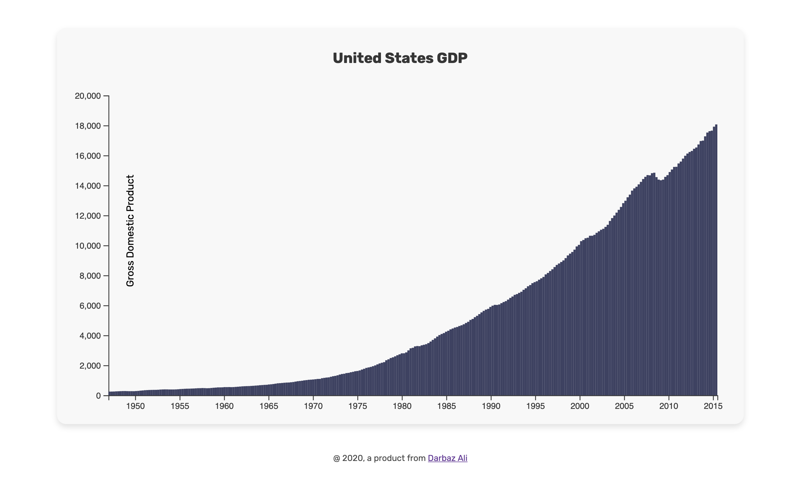

# Bar Chart with D3
This app is visulaizing United States GDP from 1950 to 2015 as Bar Chart by using D3.js

API URL
**https://raw.githubusercontent.com/freeCodeCamp/ProjectReferenceData/master/GDP-data.json**

### Usage
`npm run dev` to run the dev server.

